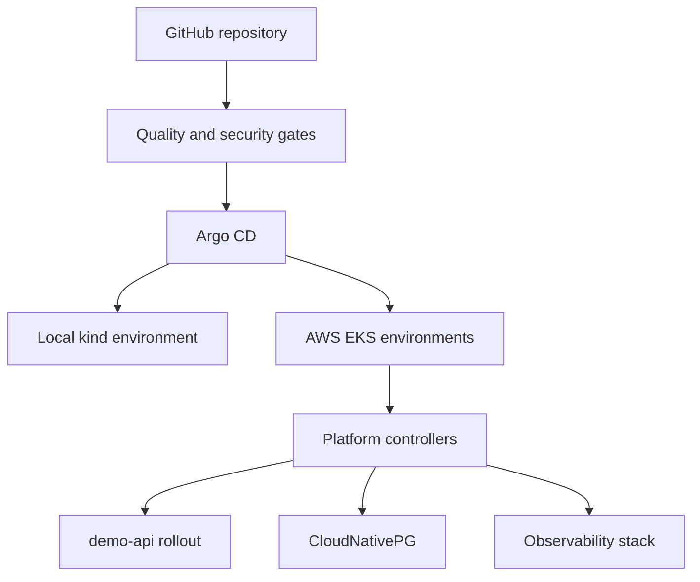

# startup-devops-baseline

A local-first DevOps and GitOps reference baseline for early-stage teams running
Kubernetes locally and on Amazon EKS. The repository combines Terraform, Argo CD,
progressive delivery, security controls, observability and governed environment
promotion in one reviewable example.

## Release status

- **Release:** `v0.12.4`
- **Scope closure checkpoint:** `v0.12.4.1.5.0.7.1.6.13-v0.12-scope-and-evidence-closure`
- **Lifecycle:** completed with explicit live and review deferrals

v0.12 closes the accepted foundation scope. It does not claim that this repository
is already a fully accepted commercial production platform.

Completed within the recorded scope:

- encrypted, versioned S3 remote state with S3-native locking and isolated keys;
- reviewed local-to-remote state migration and recovery evidence;
- build-once release identity with ordered `aws-dev -> aws-test -> aws-prod` promotion;
- automatic Promotion PR preparation with human merge and production approval;
- change-impact CI routing and static historical attestation without runtime replay;
- one complete aws-dev clean-room create, qualification and destroy lifecycle;
- an offline, fail-closed shared dev/test teardown design.

Explicitly deferred:

- the live External Secrets upgrade;
- a fresh integrated aws-test and aws-prod lifecycle rehearsal;
- aws-prod live acceptance;
- live shared teardown command adapters;
- remote-state backend retirement;
- the post-v0.12 repository, architecture and audit-material review.

See [the v0.12 closure decision](docs/V0.12.4.1.5.0.7.1.6.13_V0.12_SCOPE_AND_EVIDENCE_CLOSURE.md)
and [the final evidence manifest](delivery/contracts/v0.12-final-evidence-manifest.json).

## What this repository provides

| Area | Baseline |
| --- | --- |
| Infrastructure | Terraform modules and isolated AWS dev/test/prod roots |
| Kubernetes | kind for local work and Amazon EKS for AWS environments |
| GitOps | Argo CD Applications, Kustomize overlays and Helm values |
| Delivery | immutable image identity, Argo Rollouts and governed promotion |
| Security | admission guardrails, NetworkPolicy, IRSA and External Secrets contracts |
| Data | CloudNativePG declarations, backup and recovery procedures |
| Observability | Prometheus, Grafana, Loki, Alloy and minimal OpenTelemetry tracing |
| Operations | reviewed plans, bounded approvals, recovery records and teardown gates |

The repository is a reference implementation and engineering portfolio. Teams must
adapt account boundaries, identity, networking, capacity, data policy, availability
targets and incident procedures before using it for production workloads.

## Environment model

| Environment | Purpose | Current v0.12 evidence boundary |
| --- | --- | --- |
| `local` | fast GitOps and progressive-delivery rehearsal | supported local path |
| `aws-dev` | disposable AWS integration and runtime qualification | complete lifecycle recorded and destroyed |
| `aws-test` | reviewed pre-production promotion target | prior live evidence plus current offline teardown design; no fresh v0.12 lifecycle |
| `aws-prod` | production-like desired-state and approval boundary | statically validated; no v0.12 live acceptance |

Disposable AWS environments are intentionally separated from the retained remote-state
backend. The cost boundary allows at most one active disposable EKS environment during
reviewed exercises.

## Architecture



Git is the desired-state control plane. Terraform owns AWS infrastructure, Argo CD
owns cluster application reconciliation, and release promotion changes only reviewed
environment release identity.

For detailed topology, see:

- [Architecture](docs/ARCHITECTURE.md)
- [AWS EKS architecture](docs/AWS_EKS_ARCHITECTURE.md)
- [Environment model](docs/ENVIRONMENT_MODEL.md)
- [Multi-environment GitOps model](docs/MULTI_ENVIRONMENT_GITOPS_MODEL.md)

## Delivery lifecycle

1. Build and validate one immutable application image.
2. Update the aws-dev release identity.
3. Qualify the exact release when the disposable environment exists.
4. Prepare the aws-test Promotion PR automatically.
5. Review and merge the PR manually.
6. Repeat the same identity handoff toward aws-prod.
7. Require the protected production Environment approval before production preparation.

The orchestration model does not automatically create infrastructure, merge PRs,
promote production, destroy environments or roll back production.

Operational references:

- [Multi-environment release runbook](docs/MULTI_ENVIRONMENT_RELEASE_RUNBOOK.md)
- [Release orchestration model](docs/RELEASE_ORCHESTRATION_MODEL.md)
- [Promotion governance](docs/PROMOTION_GOVERNANCE.md)
- [GitOps rollback](docs/GITOPS_ROLLBACK.md)
- [AWS progressive delivery](docs/AWS_PROGRESSIVE_DELIVERY.md)

## Terraform state and teardown

Remote S3 state is the operational source of truth. Bootstrap, runtime identity and
dev/test/prod roots use isolated state keys. S3 versioning, SSE-KMS, public-access
blocking, TLS-only access and S3-native lockfiles form the backend baseline.

Application environment teardown does not delete the state bucket, KMS key or backend
policy foundation. Backend retirement is a separate end-of-life operation requiring
its own retention decision, reviewed plan and approval.

See:

- [Terraform state management](docs/TERRAFORM_STATE_MANAGEMENT.md)
- [Terraform outputs](docs/TERRAFORM_OUTPUTS.md)
- [AWS destroy runbook](docs/AWS_EKS_DESTROY_RUNBOOK.md)

## Getting started

Choose the smallest path that matches the intended validation:

### Local GitOps

Use the local environment for repository validation, GitOps reconciliation and
progressive-delivery exercises without AWS infrastructure.

- [Local deployment](docs/LOCAL_DEPLOYMENT.md)
- [GitOps workflow](docs/GITOPS_WORKFLOW.md)

### AWS EKS

Use the AWS path only with an explicitly reviewed account, cost window, Terraform
plan and environment lifecycle.

- [AWS EKS deployment](docs/AWS_EKS_DEPLOYMENT.md)
- [AWS EKS destroy](docs/AWS_EKS_DESTROY_RUNBOOK.md)
- [Troubleshooting](docs/TROUBLESHOOTING.md)

### Repository validation

Run the non-operational structural entry point before proposing changes:

```bash
./scripts/validate-v0.12.3.3-ci-feedback-efficiency-closure.sh --structure-only
```

Individual contracts and historical validators remain available under `scripts/`.
They are evidence and regression surfaces, not blanket authorization to execute live
AWS, Terraform, Kubernetes, S3 or GitHub operations.

## Safety model

- Terraform mutation uses a reviewed saved plan and a separate apply approval.
- Live operations bind the exact protected-main commit and a bounded UTC window.
- Private state, plans, identities and raw provider output remain outside Git.
- Automatic retry and rollback are disabled for guarded infrastructure operations.
- Promotion PR creation does not imply approval or merge.
- Production remains protected by human review and Environment approval.
- Historical evidence never grants new live authority.

## Repository layout

```text
startup-devops-baseline/
├── .github/workflows/           # CI, image and promotion workflows
├── apps/demo-api/               # sample application and Helm chart
├── clusters/                    # local and AWS GitOps declarations
├── delivery/contracts/          # machine-readable delivery and safety contracts
├── docs/                        # architecture, operations and historical decisions
├── evidence/                    # redacted, committed evidence records
├── infra/terraform/aws/         # modules, backend bootstrap and environment roots
├── platform/                    # shared Kubernetes platform components
└── scripts/                     # validation and guarded operational entry points
```

## Documentation map

| Need | Start here |
| --- | --- |
| Current supported surface | [Current authoritative surface](docs/CURRENT_AUTHORITATIVE_SURFACE.md) |
| Architecture | [Architecture](docs/ARCHITECTURE.md) |
| Local deployment | [Local deployment](docs/LOCAL_DEPLOYMENT.md) |
| AWS deployment | [AWS EKS deployment](docs/AWS_EKS_DEPLOYMENT.md) |
| Release and promotion | [Multi-environment release runbook](docs/MULTI_ENVIRONMENT_RELEASE_RUNBOOK.md) |
| Observability | [Observability guide](docs/OBSERVABILITY.md) and [v0.11 design](docs/V0.11_OBSERVABILITY_SRE_DESIGN.md) |
| State lifecycle | [Terraform state management](docs/TERRAFORM_STATE_MANAGEMENT.md) |
| Project scope | [Roadmap](docs/ROADMAP.md) |
| Version history | [Changelog](CHANGELOG.md) |

The Roadmap and Changelog are the authoritative version-history indexes. Historical
checkpoint documents and contracts preserve their original boundaries; they are not
current operator procedures unless the authoritative surface links them.

## Known limits at v0.12.4

- No fresh integrated dev/test/prod live rehearsal was completed in v0.12.
- aws-prod remains desired-state and approval-boundary validation only.
- The External Secrets supportedness path stopped before a live upgrade.
- Shared dev/test teardown adapters are offline fixed-fake designs, not live adapters.
- Account-wide zero cost is not claimed by the final aws-dev cleanup evidence.
- DR, RTO/RPO, production-control expansion and repository-wide review remain post-v0.12 work.

## Historical validator compatibility index

The rendered homepage no longer carries the cumulative checkpoint narrative. The
following collapsed index retains only legacy marker strings required by unchanged
historical validators. Full descriptions remain in the Changelog, Roadmap, documents
and contracts; no evidence was moved.

<details>
<summary>Legacy checkpoint markers</summary>

```text
v0.10  v0.10.0  v0.10.1  v0.10.2  v0.10.3  v0.10.3.1
v0.10.3.2  v0.10.4  v0.10.5  v0.10.6  v0.10.7  v0.10.8
v0.10.8.3  v0.10.8.4  v0.10.8.5  v0.10.8.6  v0.10.8.7  v0.11
v0.11.0  v0.11.1  v0.11.2  v0.11.3  v0.11.4  v0.11.4.1.1
v0.11.4.2.0  v0.11.4.2.1  v0.11.4.2.2  v0.11.5  v0.11.5.0  v0.11.5.0.1
v0.11.5.0.1-matcher-normalization-repair  v0.11.5.1  v0.11.5.1-actionable-alerts-runbooks  v0.11.5.1.1  v0.11.5.1.1-prometheus-target-down-semantics-repair  v0.11.5.1.1.1
v0.11.5.1.1.1-local-acceptance-path-repair  v0.11.5.2.0  v0.11.5.2.0-alert-lifecycle-drill  v0.11.5.2.0.1  v0.11.5.2.0.1-alertmanager-webhook-url-redaction-repair  v0.11.5.2.0.2
v0.11.5.2.0.2-alert-resolution-transition-repair  v0.11.5.2.0.3  v0.11.5.2.0.3-prometheus-rule-cleanup-synchronization-repair  v0.11.6.0  v0.11.6.0-centralized-logging-minimal-tracing-foundation  v0.11.6.1.0
v0.11.6.1.0-structured-demo-api-logging-runtime  v0.11.6.1.1  v0.11.6.1.1.5-application-scoped-alloy-loki-acceptance-repair  v0.11.6.1.2  v0.11.6.1.2.1  v0.11.6.1.2.1-events-pvc-sync-wave-validation-repair
v0.11.6.1.2.2  v0.11.6.1.3  v0.11.6.1.3-local-logging-end-to-end-closure  v0.11.6.2  v0.11.6.2.0  v0.11.6.2.0-demo-api-opentelemetry-tracing-contract
v0.11.6.2.1  v0.11.6.2.1-private-local-otel-collector-tempo-runtime  v0.11.6.2.1.1  v0.11.6.2.2  v0.11.6.2.3-local-minimal-tracing-closure  v0.11.7.0-demo-api-sli-slo-error-budget-foundation
v0.11.7.0.1-immutable-feature-root-reconciliation-repair  v0.11.7.1-multi-window-burn-rate-alerts  v0.11.7.1.1-alert-inventory-order-independence-repair  v0.11.7.1.2-grafana-dashboard-successor-live-validation-repair  v0.11.7.1.3-burn-rate-rule-inventory-jq-repair  v0.11.7.2-slo-aware-argo-rollouts-analysis
v0.11.7.2.1-slo-analysis-promql-and-live-race-repair  v0.11.7.2.2-canary-endpoint-identity-scrape-window-repair  v0.11.7.3-local-slo-progressive-delivery-closure  v0.11.7.3.1-final-rollout-convergence-wait-repair  v0.11.8.0-environment-observability-qualification-foundation  v0.11.8.1-aws-dev-live-observability-qualification
v0.11.8.1.1-observability-workflow-boundary-successor-repair  v0.11.8.1.2-aws-dev-pre-merge-feature-revision-qualification  v0.11.8.1.4-system-capacity-grafana-repair  v0.11.8.1.5-capacity-status-wait-closure  v0.11.8.2.0-aws-test-qualification-prerequisites  v0.11.8.2.0.1-barman-chart-identity-render-coverage-repair
v0.11.8.2.1-aws-test-feature-qualification  v0.11.8.2.1.1-active-gitops-preview-registration  v0.11.8.2.1.2-test-variable-input-repair  v0.11.8.2.1.3-test-target-identity  v0.11.8.2.2-test-closure-and-rebuild  v0.11.8.3-prod-read-only-qualification
v0.11.8.4-multi-environment-closure  v0.11.9  v0.11.9.0-release-rehearsal-design  v0.11.9.1-local-release-rehearsal  v0.11.9.1.1-local-release-rehearsal-stability  v0.11.9.2.0-local-failure-recovery-design
v0.11.9.2.1-local-failure-recovery-runner  v0.11.9.2.2-local-failure-recovery-live-qualification  v0.11.9.2.2.1-empty-digest-gitops-convergence-repair  v0.11.9.2.2.2-baseline-restoration-traffic-guard  v0.11.9.2.2.2.1-baseline-restoration-fixture-repair  v0.11.9.2.2.2.1.1-offline-lifecycle-environment-isolation
v0.11.9.2.2.3-prometheus-identity-traffic-lifetime  v0.11.9.2.2.3.1-successor-aware-target-query  v0.11.9.2.2.3.2-recovery-rollout-closure  v0.11.9.2.2.3.3-request-series-image-compatibility  v0.11.9.2.2.3.3.1-shellcheck-ci-parity  v0.11.9.2.2.3.3.2-immutable-local-baseline-image
v0.11.9.2.2.3.3.3-baseline-restoration-closure  v0.11.9.2.2.3.3.3.1-rendered-identity-projection-repair  v0.11.9.3.0-remote-release-rehearsal-design  v0.11.9.3.1  v0.11.9.3.1-existing-image-aws-dev-promotion  v0.11.9.3.2-protected-main-integration-readiness
v0.11.9.3.3-reviewed-main-integration  v0.11.9.3.3.1-immutable-local-aws-successor-repair  v0.11.9.3.3.2-remote-successor-chain-repair  v0.11.9.3.4-existing-image-aws-dev-promotion-execution  v0.11.9.3.5-aws-dev-live-rehearsal-preflight  v0.11.9.3.5.1-aws-dev-live-rehearsal-preflight-execution
v0.11.9.3.6-aws-dev-live-rehearsal-create-plan  v0.11.9.3.6.1-aws-dev-live-rehearsal-create-executor  v0.11.9.3.6.1.1-shellcheck-source-follow-repair  v0.11.9.3.6.2-aws-dev-infrastructure-create-execution  v0.11.9.3.6.2.1-live-state-test-isolation-repair  v0.11.9.3.6.3-aws-dev-guarded-gitops-bootstrap
v0.11.9.3.6.3.1-aws-dev-gitops-bootstrap-execution  v0.11.9.3.6.4-aws-dev-guarded-root-application-deploy  v0.11.9.3.6.4.1-aws-dev-monitoring-convergence  v0.11.9.3.6.4.2-aws-dev-monitoring-convergence-execution  v0.11.9.3.6.4.3-aws-environment-teardown-convergence  v0.11.9.3.6.5-aws-dev-runtime-qualification
v0.11.9.3.6.5.1-runtime-qualification-prometheus-transport-repair  v0.11.9.3.6.5.1.1-port-forward-readiness-budget-repair  v0.11.9.3.6.5.2-aws-dev-runtime-qualification-execution  v0.11.9.3.6.6-reviewed-live-aws-test-promotion-handoff  v0.11.9.3.6.6.1-aws-test-successor-validation-repair  v0.11.9.3.6.6.2
v0.11.9.3.6.6.3  v0.11.9.3.6.6.4  v0.11.9.3.6.6.5  v0.11.9.3.6.6.5.1  v0.11.9.3.6.6.5.2  v0.11.9.3.6.6.6
v0.11.9.3.6.6.6.1  v0.11.9.3.6.7  v0.11.9.3.6.7-guarded-aws-test-live-creation-preflight  v0.11.9.3.6.7.1  v0.11.9.3.6.7.1-guarded-aws-test-private-creation-plan-design  v0.11.9.3.6.7.2
v0.11.9.3.6.7.2-guarded-aws-test-terraform-plan-executor  v0.11.9.3.6.7.2.1  v0.11.9.3.6.7.2.1-aws-test-terraform-plan-execution-evidence  v0.11.9.3.6.7.3  v0.11.9.3.6.7.3-guarded-aws-test-terraform-apply-executor  v0.11.9.3.6.7.3.1
v0.11.9.3.6.7.3.1-aws-test-state-classification-repair  v0.11.9.3.6.7.3.1.1  v0.11.9.3.6.7.3.1.1-aws-test-apply-and-resume-execution-evidence  v0.11.9.3.6.7.4  v0.11.9.3.6.7.4-guarded-aws-test-gitops-bootstrap  v0.11.9.3.6.7.4.1
v0.11.9.3.6.7.4.1-aws-test-gitops-bootstrap-execution-evidence  v0.11.9.3.6.7.4.1.1-gitleaks-evidence-field-repair  v0.11.9.3.6.7.5-aws-test-recovery-root-design  v0.11.9.3.6.7.5.1-aws-test-root-capacity-cost  v0.11.9.3.6.7.5.2-aws-test-immutable-root-deployment  v0.11.9.3.6.7.5.2.1-aws-test-root-execution-evidence
v0.11.9.3.6.7.6-guarded-aws-test-teardown  v0.11.9.3.6.7.6.1-cleanup-window-renewal  v0.11.9.3.6.7.6.2-runtime-cleanup-resume  v0.11.9.3.6.7.6.3-remaining-cleanup  v0.11.9.3.6.7.6.4-eks-dependency-plan-repair  v0.11.9.3.6.7.6.5-teardown-execution-evidence
v0.11.9.3.6.7.6.6-guarded-residual-cost-audit  v0.11.9.3.6.7.6.6.1-audit-error-envelope-repair  v0.11.9.3.6.7.6.6.2-instant-fleet-classification-repair  v0.11.9.3.6.7.6.6.3-residual-cost-audit-execution-evidence  v0.11.9.3.6.7.7-cross-environment-guarded-runtime-review  v0.11.9.3.6.7.7.1-shared-guarded-runtime-pure-rules
v0.11.9.3.6.7.7.10-dev-offline-command-entry-conformance  v0.11.9.3.6.7.7.11-dev-local-cli-preflight  v0.11.9.3.6.7.7.12-dev-local-offline-execute  v0.11.9.3.6.7.7.13-dev-local-offline-restart-chain  v0.11.9.3.6.7.7.14-dev-live-parity-gap-review  v0.11.9.3.6.7.7.15-dev-live-transport-design
v0.11.9.3.6.7.7.16-dev-injected-transport-protocol  v0.11.9.3.6.7.7.17-dev-restart-safe-receipt-adapter  v0.11.9.3.6.7.7.18-dev-local-offline-command  v0.11.9.3.6.7.7.19-dev-local-offline-process-chain  v0.11.9.3.6.7.7.2-shared-guarded-cleanup-rules  v0.11.9.3.6.7.7.20-v0.11-scope-and-evidence-closure
v0.11.9.3.6.7.7.20.1-roadmap-status-successor-repair  v0.11.9.3.6.7.7.3-shared-plan-scope-and-attempt-journal  v0.11.9.3.6.7.7.4-shared-offline-destroy-adapters  v0.11.9.3.6.7.7.5-shared-offline-cleanup-adapters  v0.11.9.3.6.7.7.6-complete-offline-runtime-parity-review  v0.11.9.3.6.7.7.7-shared-offline-freeze-adapter
v0.11.9.3.6.7.7.8-live-transport-and-receipt-migration-design  v0.11.9.3.6.7.7.9-dev-offline-transport-conformance-and-durable-receipts  v0.12  v0.12.0  v0.12.0-production-readiness-foundation  v0.12.1
v0.12.1-remote-state-foundation  v0.12.1.0.1  v0.12.1.0.1-ci-compatibility-repair  v0.12.1.1  v0.12.1.1-guarded-state-bootstrap-plan  v0.12.1.2
v0.12.1.2-reviewed-state-bootstrap-apply  v0.12.1.2-reviewed-state-bootstrap-apply.json  v0.12.1.2.0.1  v0.12.1.2.0.1-state-bootstrap-post-apply-recovery  v0.12.1.2.1  v0.12.1.2.1-state-bootstrap-execution-evidence
v0.12.1.2.1-state-bootstrap-execution-evidence.json  v0.12.2  v0.12.2.0  v0.12.2.0-state-migration-design-foundation  v0.12.2.0-state-migration-design-foundation.json  v0.12.2.0.1
v0.12.2.0.1-private-bootstrap-state-location-repair  v0.12.2.0.1-private-bootstrap-state-location-repair.json  v0.12.2.1  v0.12.2.1-private-bootstrap-migration-preflight  v0.12.2.1-private-bootstrap-migration-preflight.json  v0.12.2.2
v0.12.2.2-reviewed-bootstrap-state-migration  v0.12.2.2-reviewed-bootstrap-state-migration.json  v0.12.2.2.0.1  v0.12.2.2.0.1-bootstrap-state-identity-rebase-recovery  v0.12.2.2.0.1-bootstrap-state-identity-rebase-recovery.json  v0.12.2.2.0.2
v0.12.2.2.0.2-identity-rebase-digest-encoding-repair  v0.12.2.2.0.2-identity-rebase-digest-encoding-repair.json  v0.12.2.2.1  v0.12.2.2.1-bootstrap-state-migration-recovery-evidence  v0.12.2.2.1-bootstrap-state-migration-recovery-evidence.json  v0.12.2.3
v0.12.2.3.0  v0.12.2.3.0-remote-state-proof-and-recovery-design  v0.12.2.3.0-remote-state-proof-and-recovery-design.json  v0.12.2.3.1  v0.12.2.3.1-guarded-remote-state-proof  v0.12.2.3.1-guarded-remote-state-proof.json
v0.12.2.3.1.0.1  v0.12.2.3.1.0.1-guarded-refresh-only-recovery-plan  v0.12.2.3.1.0.1-guarded-refresh-only-recovery-plan.json  v0.12.2.3.1.0.1.0.1  v0.12.2.3.1.0.1.0.1-refresh-only-plan-evidence-recovery  v0.12.2.3.1.0.1.0.1-refresh-only-plan-evidence-recovery.json
v0.12.2.3.1.0.2  v0.12.2.3.1.0.2-reviewed-refresh-only-state-reconciliation  v0.12.2.3.1.0.2-reviewed-refresh-only-state-reconciliation.json  v0.12.2.3.1.0.2.0.1  v0.12.2.3.1.0.2.0.1-state-pull-check-results-normalization-repair  v0.12.2.3.1.0.2.0.1-state-pull-check-results-normalization-repair.json
v0.12.2.3.1.0.2.0.1.1  v0.12.2.3.1.0.2.0.1.1-semantic-projection-digest-repair  v0.12.2.3.1.0.2.0.1.1-semantic-projection-digest-repair.json  v0.12.2.3.1.0.2.0.1.2  v0.12.2.3.1.0.2.0.1.2-dual-form-pre-apply-state  v0.12.2.3.1.0.2.0.1.2-dual-form-pre-apply-state.json
v0.12.2.3.1.0.2.0.1.2.0.1  v0.12.2.3.1.0.2.0.1.2.0.1-post-apply-state-recovery  v0.12.2.3.1.0.2.0.1.2.0.1-post-apply-state-recovery.json  v0.12.2.3.1.0.2.0.1.2.0.1.1-refresh-plan-shape-repair.json  v0.12.2.3.1.0.2.0.1.2.0.1.2-terminal-recovery-evidence.json  v0.12.2.4.1
v0.12.2.4.1-validator-orchestration-dedup  v0.12.2.4.2  v0.12.2.4.2-quality-gate-history-dedup  v0.12.3.1  v0.12.3.1-ci-change-impact-routing  v0.12.3.1.1
v0.12.3.1.1-release-change-routing-repair  v0.12.3.2  v0.12.3.2-post-promotion-historical-snapshot  v0.12.3.3  v0.12.3.3-ci-feedback-efficiency-closure  v0.12.3.4
v0.12.3.4-promotion-lifecycle-convergence-closure  v0.12.4.0  v0.12.4.0-upgrade-lifecycle-design-foundation  v0.12.4.1  v0.12.4.1-official-compatibility-matrix  v0.12.4.1.1
v0.12.4.1.1-platform-supportedness-repair-design  v0.12.4.1.2  v0.12.4.1.2-external-secrets-supportedness-repair-plan  v0.12.4.1.3  v0.12.4.1.3-external-secrets-artifact-and-render-proof  v0.12.4.1.4
v0.12.4.1.4-external-secrets-2.9.0-hop-plan  v0.12.4.1.5  v0.12.4.1.5-external-secrets-live-preflight-contract  v0.12.4.1.5.0.3  v0.12.4.1.5.0.3-aws-dev-remote-state-clean-room-reconstruction-design  v0.12.4.1.5.0.4
v0.12.4.1.5.0.4-guarded-aws-dev-remote-state-clean-room-preflight  v0.12.4.1.5.0.5  v0.12.4.1.5.0.5-guarded-aws-dev-remote-state-saved-create-plan  v0.12.4.1.5.0.5.0.1  v0.12.4.1.5.0.5.0.1-aws-dev-create-plan-management-cidr-recovery  v0.12.4.1.5.0.6
v0.12.4.1.5.0.6-reviewed-aws-dev-recovery-saved-plan-apply  v0.12.4.1.5.0.6.0.1  v0.12.4.1.5.0.6.0.1-aws-dev-post-apply-read-only-recovery  v0.12.4.1.5.0.6.0.1.1  v0.12.4.1.5.0.6.0.1.1-aws-dev-semantic-state-recovery  v0.12.4.1.5.0.7
v0.12.4.1.5.0.7-aws-dev-post-create-qualification  v0.12.4.1.5.0.7.1  v0.12.4.1.5.0.7.1-guarded-aws-dev-teardown  v0.12.4.1.5.0.7.1.1  v0.12.4.1.5.0.7.1.1-zero-drift-plan-gate-repair  v0.12.4.1.5.0.7.1.2
v0.12.4.1.5.0.7.1.2-aws-dev-partial-teardown-recovery  v0.12.4.1.5.0.7.1.3  v0.12.4.1.5.0.7.1.3-aws-dev-final-cleanup  v0.12.4.1.5.0.7.1.4  v0.12.4.1.5.0.7.1.4-aws-dev-vpc-only-recovery  v0.12.4.1.5.0.7.1.5
v0.12.4.1.5.0.7.1.5-aws-dev-eks-sg-vpc-cleanup  v0.12.4.1.5.0.7.1.5.1  v0.12.4.1.5.0.7.1.5.1-aws-dev-eks-sg-delete-response-recovery  v0.12.4.1.5.0.7.1.5.2  v0.12.4.1.5.0.7.1.5.2-aws-dev-final-cleanup-execution-evidence  v0.12.4.1.5.0.7.1.6
v0.12.4.1.5.0.7.1.6-generalized-multi-environment-teardown-hardening-design  v0.12.4.1.5.0.7.1.6.1  v0.12.4.1.5.0.7.1.6.1-shared-dev-test-two-wave-teardown-core  v0.12.4.1.5.0.7.1.6.10  v0.12.4.1.5.0.7.1.6.10-shared-dev-test-lease-registry-command  v0.12.4.1.5.0.7.1.6.11
v0.12.4.1.5.0.7.1.6.11-shared-dev-test-offline-process-chain  v0.12.4.1.5.0.7.1.6.12  v0.12.4.1.5.0.7.1.6.12-shared-dev-test-offline-closure  v0.12.4.1.5.0.7.1.6.13  v0.12.4.1.5.0.7.1.6.13-v0.12-scope-and-evidence-closure  v0.12.4.1.5.0.7.1.6.2
v0.12.4.1.5.0.7.1.6.2-shared-dev-test-two-wave-teardown-request-preflight  v0.12.4.1.5.0.7.1.6.3  v0.12.4.1.5.0.7.1.6.3-shared-dev-test-two-wave-teardown-private-preflight  v0.12.4.1.5.0.7.1.6.4  v0.12.4.1.5.0.7.1.6.4-shared-dev-test-two-wave-teardown-receipt-approval  v0.12.4.1.5.0.7.1.6.5
v0.12.4.1.5.0.7.1.6.5-shared-dev-test-phase-execution-lease  v0.12.4.1.5.0.7.1.6.6  v0.12.4.1.5.0.7.1.6.6-shared-dev-test-phase-drivers  v0.12.4.1.5.0.7.1.6.7  v0.12.4.1.5.0.7.1.6.7-shared-dev-test-command-adapter-registry  v0.12.4.1.5.0.7.1.6.8
v0.12.4.1.5.0.7.1.6.8-shared-dev-test-claimed-registry-runner  v0.12.4.1.5.0.7.1.6.9  v0.12.4.1.5.0.7.1.6.9-shared-dev-test-lease-registry-composition  v0.74.0  v0.8  v0.9
v0.9.0  v0.9.1  v0.9.2  v0.9.3  v0.9.4  v0.9.5
v0.9.6  v0.9.7  v0.9.8  v3.5.2
v0.11.9.3.6.6.5.2 aws-dev teardown execution evidence
v0.11.9.3.6.6.6 guarded aws-dev residual-cost audit
v0.11.9.3.6.6.6.1 aws-dev residual-cost audit execution evidence
v0.11.9.3.6.7 guarded aws-test live-creation preflight
v0.11.9.3.6.7.1 guarded aws-test private creation-plan design
v0.11.9.3.6.7.2 guarded aws-test Terraform plan executor
v0.11.9.3.6.7.2.1 aws-test Terraform plan execution evidence
```

</details>
