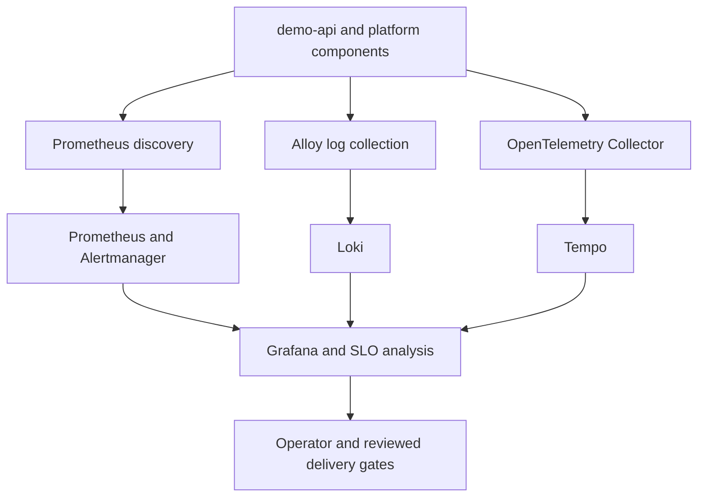

# v0.11 Observability and SRE Design Foundation

## Purpose

v0.11 makes the existing local and AWS multi-environment platform observable
and operationally actionable. It builds on the immutable delivery identity,
reviewed Promotion, runtime qualification, and recovery boundaries completed
in v0.10.

The version is successful when an operator can answer, with release-bound
evidence:

1. Is the service healthy from the user's perspective?
2. Which environment, release, image, source commit, and Kubernetes workload
   produced the signal?
3. Is the problem caused by the application, delivery control plane, data
   dependency, Kubernetes platform, or capacity layer?
4. Is a Promotion safe to continue?
5. Which reviewed Runbook or recovery boundary applies?

v0.11.0 is a design-only checkpoint. It adds no runtime component and changes
no v0.10 workflow, permission, evidence, application, Terraform, Kubernetes,
or AWS resource.

Implementation status: v0.11.1 now delivers the pinned Operator-managed
metrics foundation described by this design. Its exact profiles, migration,
offline validation, and still-unclaimed live checks are documented in
`docs/V0.11.1_METRICS_FOUNDATION.md`.

v0.11.2 now delivers application-owned Prometheus discovery, bounded HTTP and
PostgreSQL dependency metrics, and Pod-derived release correlation. Its
offline implementation, operator-validated local path, and still-unclaimed
formal AWS evidence are documented in
`docs/V0.11.2_APPLICATION_PLATFORM_TELEMETRY.md`.

v0.11.3 adds a safe local feature-revision GitOps validation path after live
testing exposed that the Root Application could restore same-repository child
Applications to `HEAD`. The repository declarations remain stable while
runtime-only feature overrides are explicit and reversible.

v0.11.4.0 now enables the private Grafana runtime and deploys the first
repository-owned recording rules and immutable service overview Dashboard.
The new `observability-views` Application inherits the same resolved feature
commit as Root, namespace guardrails, and demo-api. Delivery, data, platform,
capacity, and resource-efficiency views continue in v0.11.4.1 and v0.11.4.2.

v0.11.4.1.0 establishes the version-verified controller metric inputs for
those views. It observes the installed Argo CD semantic version without a
control-plane upgrade, advances Argo Rollouts to its patched controller
version, adds repository-owned controller and AWS CloudNativePG discovery, and
provides Delivery, Data, and Platform diagnostic recording rules.

v0.11.4.1.1 now provisions the immutable Delivery, Data, and Platform
Dashboards backed only by those accepted rules. Local acceptance requires the
delivery, demo-api dependency, and platform results while preserving explicit
no-data for AWS-only CloudNativePG panels.

v0.11.4.2.0 now establishes cluster capacity and namespace resource-efficiency
signals from the existing kube-state-metrics and kubelet/cAdvisor targets. It
records allocatable capacity, active requests and limits, usage-to-request
ratios, and bounded missing-request coverage without claiming scheduler-exact
fit or currency cost.

v0.11.4.2.1 now provisions the immutable Capacity and Resource Efficiency
Dashboard backed only by those twenty accepted rules. It preserves the four
existing Dashboard identities, exposes namespace filtering and request
coverage, and adds no raw metric, cost, alert, or automation path. One clean
local feature replay closes v0.11.4.2 after live acceptance.

v0.11.4.2.2 repairs that replay after the neutral feature baseline was
mistaken for an acceptance state. It requires a fresh local image transition,
positive Prometheus target health, direct source telemetry preflight, and
scrape-error diagnostics without changing the accepted runtime resources.

v0.11.5.0 now enables one environment-local Alertmanager through the pinned
monitoring release. It establishes private exposure, bounded storage and
resources, stable severity routing, alert-family inhibition, and direct
Prometheus discovery validation without adding an alert rule or external
notification integration.

v0.11.5.0.1 repairs only the acceptance parser discovered during the first
live replay. Alertmanager canonicalizes matcher whitespace in `/api/v2/status`;
the shared offline/live check now accepts that representation while requiring
exactly two critical and two warning matchers. The deployed configuration is
unchanged and does not require a GitOps redeployment.

v0.11.5.1 adds the bounded actionable inventory: two warning and six critical
alerts across demo-api HTTP and dependency reliability, GitOps delivery,
Kubernetes Deployment availability, and AWS-profile PostgreSQL collection.
Every alert
uses stable environment, cluster, component, and alert-family routing labels
and one repository-owned Runbook. Real firing, routing, inhibition, resolution,
and notification-path drills remain v0.11.5.2 work.

v0.11.5.1.1 repairs Prometheus target-down counting with `up == bool 0` and
adds `PrometheusTargetDown` as the ninth alert. The successor inventory is two
warning and seven critical alerts. Its live acceptance compares the recorded
namespace/job vector with the direct Boolean query and still preserves no-data
for an absent group.

v0.11.5.1.1.1 repairs only that local acceptance path: the ownership preflight
uses `operator-diagnostic-recording-rules`, and a neutral-baseline replay must
transition through a unique current-source image before telemetry checks. It
changes no monitoring resource or alert policy.

v0.11.5.2.0 implements the local firing, routing, inhibition, resolution, and
notification-path drill. Two narrowly matched routes use a temporary
in-cluster webhook sink while continuing into the existing severity routes.
The guarded script proves warning and critical firing/resolved delivery,
positive inhibition, unequal-scope isolation, and zero residual resources.
The nine formal alerts remain unchanged; external providers and formal AWS
execution remain v0.11.8 or v0.12 work.

v0.11.5.2.0.1 repairs the live configuration parser after Alertmanager
redacted both loaded webhook URLs as `<secret>` in `/api/v2/status`. Repository
and literal-fixture validation still binds the two exact internal URLs, while
runtime validation requires exactly two redacted URL lines. The repair changes
no desired state and requires no monitoring redeployment.

v0.11.5.2.0.2 repairs the next live-drill failure without expanding the
observability architecture. Each synthetic alert retains its rule, name, and
labels while its expression changes from `vector(1)` to the empty-vector
`vector(0) == 1`. Prometheus clearing and resolved webhook delivery must precede
rule deletion. Global stale-drill-alert checks make repeated execution
fail-closed. No Chart, runtime configuration, image, AWS boundary, or permanent
resource changes.

v0.11.5.2.0.3 repairs the final asynchronous cleanup boundary exposed after
all four repaired phases completed. Kubernetes deletion is strict during the
normal success path, while Prometheus rule-inventory absence is a separate
bounded convergence condition required before the exact nine-alert baseline.
EXIT-trap cleanup remains best-effort. This changes no permanent monitoring
resource, alert policy, or architecture boundary.

The repaired full local rerun passed, so v0.11.5 is accepted locally.
v0.11.6.0 then fixes the implementation boundary for the next line without
deploying a runtime. Centralized logging is environment-local rather than one
shared dev/test/prod backend. Alloy owns Pod logs and Kubernetes Events, Loki
owns log storage, an upstream OpenTelemetry Collector owns OTLP processing and
sampling, Tempo owns the minimal trace store, and Grafana owns cross-signal
navigation. High-cardinality correlation values remain structured fields, not
Loki labels. Runtime logs start in v0.11.6.1, traces in v0.11.6.2, correlation
acceptance in v0.11.6.3, and clean replay closure in v0.11.6.4.

v0.11.6.1.0 implements the first logging runtime slice without changing that
architecture. demo-api emits one bounded JSON object per stdout line, uses
route templates rather than raw URLs, suppresses successful probe and scrape
noise, and receives canonical release identity from Pod annotations through
the Downward API. v0.11.6.1.1 then implements the private local Loki
Monolithic store and node-local Alloy Pod-log path. It fixes an exact six-label
index, keeps Pod and release identity out of the index, uses Kubernetes API
collection without host mounts, and bounds disposable storage to 2 GiB with
24-hour retention. v0.11.6.1.2 adds an independent singleton Alloy Event
collector, persistent read positions for restart replay protection, the same
six-label Event-stream boundary, and a Git-provisioned private Grafana Loki
data source. Tracing remains deferred to v0.11.6.2.

The machine-readable boundary is:

```text
delivery/contracts/v0.11-observability-sre-foundation.json
```

Its offline validator is:

```text
scripts/validate-v0.11-observability-sre-foundation.sh
```

## v0.11.0 Baseline and Gap

The repository currently proves basic local Prometheus scraping and uses
release-bound Web AnalysisRuns for AWS Canary readiness and identity. It does
not yet provide a production-oriented AWS metrics stack, durable centralized
logs, actionable alert routing, service SLOs, error-budget alerts, or
cross-signal correlation.

The local Prometheus Deployment remains useful as historical v0.1 baseline
material. v0.11.1 will define the migration and compatibility path rather than
silently treating that Deployment as a production monitoring platform.

## Architecture Direction



The intended component classes are:

| Capability | Direction | Boundary |
| --- | --- | --- |
| Metrics control plane | Prometheus Operator and kube-prometheus-stack | Exact chart and component versions are pinned in v0.11.1 |
| Kubernetes metrics | kube-state-metrics and node-exporter | Environment-aware scheduling and resource limits are required |
| Dashboards | Grafana provisioned through GitOps | Dashboards are version-controlled, not edited only in the UI |
| Alerting | Alertmanager and PrometheusRule | Every actionable alert links to a reviewed Runbook |
| Logs | Structured JSON to stdout/stderr, collected by Grafana Alloy | Credentials, request bodies, Authorization headers, and raw SQL parameters are excluded |
| Log backend | Loki | Retention and storage differ by environment profile |
| Traces | OpenTelemetry SDK and OTLP through an upstream OpenTelemetry Collector | Application code is not coupled to Tempo, Jaeger, X-Ray, or a SaaS backend |
| Trace backend | OTLP-compatible backend, initially suitable for a minimal Tempo path | Distributed HA, long-term object storage, and multi-tenancy are not required in v0.11.0 |

## Environment Profiles

One manifest shape does not imply one cost or retention profile.

| Environment | Profile | Persistence and retention | Claim |
| --- | --- | --- | --- |
| local | lightweight | disposable and short | functional development only |
| aws-dev | cost-optimized | bounded and short | live development qualification |
| aws-test | cost-optimized production parity | bounded and short | controlled Canary and SRE validation |
| aws-prod | production parity | explicit persistence and policy-controlled retention | only after live v0.11 acceptance |

AWS test and production environments may remain disposable portfolio
environments. A production-parity configuration means that safety, topology,
retention, storage, and approval choices are explicit; it does not require
three permanently running clusters.

Every later increment must document:

- requested and limited CPU and memory;
- storage class, capacity, retention, and deletion behavior;
- placement on system, application, or dedicated observability capacity;
- NetworkPolicy ingress and egress;
- credentials and Secret ownership;
- expected idle and validation-window cost;
- teardown and residual-cost checks.

## Telemetry Identity and Release Correlation

The same release already promoted through dev, test, and production must remain
identifiable in metrics, logs, traces, dashboards, alerts, and qualification
evidence.

Required stable resource attributes are:

```text
service.name
service.version
deployment.environment.name
platform.release.id
platform.source.commit
container.image.digest
```

Structured application logs additionally carry, when available:

```text
trace_id
span_id
platform.release.id
```

Kubernetes Pod names, IP addresses, UIDs, node names, and trace IDs are useful
correlation data but are not stable service-level aggregation dimensions.

The design rejects unbounded or sensitive dimensions such as raw request
bodies, Authorization headers, database parameters, user identifiers, and raw
URL query strings.

## Extensible Tracing Foundation

v0.11 does not need a complex distributed tracing platform, but it must avoid a
future tracing retrofit.

The initial path is:

```text
HTTP request -> demo-api server span -> PostgreSQL client span
```

The application requirements are:

- use OpenTelemetry APIs or supported auto-instrumentation;
- accept and propagate W3C Trace Context;
- export OTLP to a Collector boundary;
- configure sampling outside application code;
- include trace and span identifiers in structured logs;
- never call a Tempo-, Jaeger-, X-Ray-, or vendor-specific API from business
  logic;
- exclude secrets and raw SQL parameters from span attributes.

Later multi-service, messaging, model-inference, tail-sampling, service-graph,
multi-tenant, object-storage, and cross-cluster capabilities can then be added
at the SDK, Collector, or backend layer without replacing the application
contract.

## SLI and SLO Model

The first service-level indicators cover:

- request availability;
- request success rate;
- request latency;
- PostgreSQL dependency availability.

Platform health metrics support diagnosis but do not replace user-facing
service indicators. CPU usage alone, for example, is not an availability SLI.

SLO targets are selected after a measured baseline exists. v0.11 does not
invent a 100-percent objective. Each accepted SLO must define:

- SLI query and valid-event population;
- target and evaluation window;
- error budget;
- fast and slow burn-rate alerts;
- missing-data behavior;
- related Dashboard and Runbook;
- effect on Canary progression and operator response.

The initial golden-signal coverage is latency, traffic, errors, and
saturation.

## Alerting and Runbook Contract

An alert is actionable only when it identifies:

- environment and affected component;
- severity and user impact;
- current release identity when applicable;
- supporting query or Dashboard;
- version-controlled Runbook;
- whether the condition blocks Promotion;
- whether recovery is observation-only, a reviewed PR, or a separately
  approved runtime action.

Alert tests must prove both firing and recovery. A static PrometheusRule that
has never been evaluated against a controlled condition is not live evidence.

## Delivery Integration Boundary

v0.11 extends qualification facts; it does not discard the v0.10 governance
model.

The following remain false:

- automatic EKS environment creation;
- automatic pull-request merge;
- automatic production Rollout progression;
- automatic rollback;
- production Kubernetes write by a qualification job;
- production AWS mutation by a qualification job.

Production continues to require its GitHub Environment approval and reviewed
release-only PR. v0.11.8 may add an approval-protected, read-only aws-prod
runtime observation boundary. That boundary can read the exact facts needed to
qualify the release and observability platform; it cannot sync Argo CD,
progress a Rollout, patch Kubernetes, invoke Terraform, or dispatch rollback.

## Increment Plan

| Increment | Outcome |
| --- | --- |
| v0.11.0 | Design, version, security, cost, tracing, repository, and acceptance contracts |
| v0.11.1 | Production-oriented metrics foundation and environment profiles |
| v0.11.2 | Application and platform telemetry with stable release correlation |
| v0.11.3 | Safe local feature-revision GitOps validation and HEAD restoration |
| v0.11.4 | Dashboards and recording rules; v0.11.4.0 delivers Grafana, application rules, and the first service view |
| v0.11.5 | Actionable alerts, routing, inhibition, Runbooks, and drills |
| v0.11.6 | Centralized logs and minimal extensible tracing path; v0.11.6.0 defines the architecture, v0.11.6.1.0 implements bounded demo-api JSON logging, v0.11.6.1.1 adds private local Loki plus Alloy Pod-log collection, and v0.11.6.1.2 adds singleton Kubernetes Events plus the Grafana Loki data source |
| v0.11.7 | SLOs, error budgets, burn-rate alerts, and SLI-based Rollout gates |
| v0.11.8 | Dev/test/prod observability qualification boundaries |
| v0.11.9 | Clean-room live end-to-end acceptance and closure evidence |

Each increment must pass offline validation before live AWS work. A manifest or
contract must not claim a live result until the corresponding environment was
created, the signal was queried, and reviewed evidence was recorded.

## Final Acceptance Direction

v0.11.9 performs one clean-room, build-once release through live aws-dev,
aws-test, and aws-prod environments. The preferred candidate is the image
created after the v0.10.8.7 security hotfix because that candidate has not been
claimed by the sealed v0.10 live evidence.

The acceptance sequence must include:

1. one immutable image digest promoted through all three environments;
2. successful dev and test runtime plus observability Qualification;
3. reviewed test Canary completion;
4. protected production approval and release-only PR merge;
5. approval-protected, read-only production observability Qualification;
6. one intentionally failed Canary analysis caused by a controlled service
   signal, without automatic rollback;
7. an actionable alert that fires and recovers;
8. metric, log, trace, and release-identity correlation;
9. reviewed v0.11 final evidence;
10. disposable environment teardown and residual-cost audit.

This is an end-to-end orchestrated release, not a zero-approval deployment.
Human PR review, test Canary completion, production approval, and production
recovery decisions remain required controls.

## Deferred to v0.12

The following former v0.11 items now belong to the Production Readiness
Capstone:

- encrypted remote Terraform state and S3-native locking;
- state backup, access, and recovery;
- EKS and platform dependency upgrade lifecycle;
- full clean-room infrastructure rebuild capstone;
- measured RTO and RPO;
- break-glass and production-access review;
- repository-wide production readiness, documentation, and commercial
  acceptance.

## Repository Boundary

This repository owns general application and platform observability, SLI/SLO
patterns, release correlation, and human-governed operational response.

The separate `SterlingAureum/ai-infra-blueprints` repository owns GPU node
pools, NVIDIA drivers and operators, vLLM, model artifacts, GPU and inference
benchmarking, model-serving specifics, and Slurm training infrastructure.
v1.1 may document common contracts and an integration example, but v0.11 does
not add those AI infrastructure components here.

OpenClaw integration and AIOps implementation are not part of v0.11.
